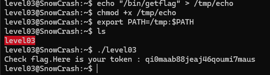

Level03

On voit un fichier/executable level03. Il a un bit SUID active (s dans -rwsr-sr-x).
Ca signifie qu’il utilise les droits de flag03.
Le but est de tromper ce programme pour qu'il exécute une commande comme getflag avec les droits de flag03.
Utilise strings pour voir si le programme appelle une commande système.

On voit /usr/bin/env echo Exploit me . Cette commande va chercher echo dans les dossiers définis par la variable d'environnement PATH.
Si on modifie le PATH pour qu’il regarde d'abord dans un dossier où on a créé notre propre faux programme echo, le programme level03 (qui tourne avec les droits de flag03) exécutera le code au lieu du vrai echo.

token: qi0maab88jeaj46qoumi7maus

